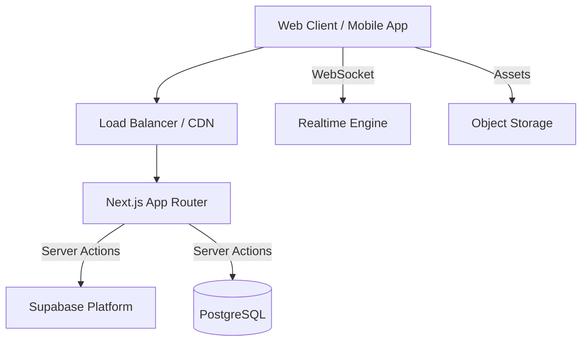

# Architecture

## High Level Overview

The Catery platform is a modern SaaS built on a cloud-native stack.

## Components
- **Frontend**: Next.js 15+ with React Server Components.
- **Backend API**: Integrated via Next.js Server Actions and Route Handlers.
- **Database**: PostgreSQL (managed by Supabase) with Row Level Security (RLS).
- **Auth**: Supabase Auth (JWT based).
- **Observability**: Sentry for error tracking and performance monitoring.

## Data Stores
- **Primary**: PostgreSQL for transactional data (Events, Staff, etc.).
- **Cache**: Next.js Data Cache & Tag-based revalidation.
